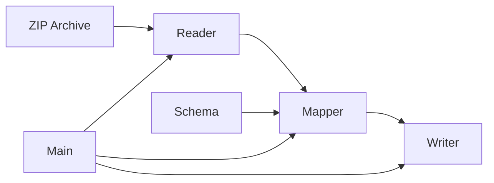

# Wireless Data License Processor

## Overview

"wdlp" is a Python-based tool for processing the Federal Communications Commission (FCC) Wireless Data License Database `.dat` files. It transforms these files into various formats (JSONL, Parquet, Ion, CSV) while validating them against predefined schemas based on the [Public Access Database Definitions](https://www.fcc.gov/sites/default/files/public_access_database_definitions_20240215.pdf).

The raw `.dat` files can be obtained from the [FCC ULS Daily/Weekly Transactions](https://www.fcc.gov/uls/transactions/daily-weekly) page.

## Installation

### Using pip
```bash
pip install wdlp
```

### Using Docker
1. Build the image:
```bash
docker build -t wdlp .
```

The image uses Python 3.9-slim as its base to minimize size while maintaining compatibility.

Note: The Docker Hub repository information will be added once the project is published.

## Usage

### Command Line Interface
```bash
# Basic usage (processes all .dat files in the ZIP archive)
wdlp --input archive.zip --output output_dir/ --format jsonl

# Specify different output format
wdlp --input archive.zip --output output_dir/ --format parquet
```

The tool currently supports processing ZIP archives containing `.dat` files. Each supported record type (AM, EN) will be processed and saved to a separate file in the output directory.

### Using Docker

#### Using docker run
```bash
# Mount local directories for input/output
docker run -v $(pwd)/input:/input -v $(pwd)/output:/output wdlp \
    --input /input/archive.zip \
    --output /output \
    --format jsonl
```

#### Using docker-compose
1. The included docker-compose.yml provides a pre-configured setup:
```yaml
version: '3.8'
services:
  wdlp:
    build: .
    volumes:
      - ./data:/data  # Mount the local data directory
```

2. Place your .dat files in the local `data/` directory

3. Run using compose:
```bash
docker-compose up
```

By default, docker-compose mounts the local `data/` directory to `/data` in the container and processes files using JSONL format.

### Supported Record Types
- AM: Amateur License records
- EN: Entity records

### Output File Structure
For an input archive containing AM.dat and EN.dat, the output directory will contain:
```
output_dir/
  ├── AM.[format]  # Amateur License records
  └── EN.[format]  # Entity records
```

### Supported Output Formats
- JSONL (JSON Lines)
- Parquet
- Ion (Amazon Ion)
- CSV

## Architecture Overview

The Wireless Data License Processor (wdlp) follows a modular, pipeline-based architecture designed for efficient processing of FCC database files. The system is composed of five core components that work together to transform raw data into validated, structured output.



### Data Flow
1. Input: ZIP archive containing `.dat` files
2. Reader: Streams and parses raw records
3. Mapper: Validates and transforms records using schemas
4. Writer: Writes processed records to output files
5. Main: Orchestrates the entire process

## Core Components

Each component is designed to be modular, extensible, and focused on a single responsibility:

### 1. [Schema](docs/source/schema.md)
The Schema component defines the data structure and validation rules:

```python
from pydantic import BaseModel, Field
from typing import Optional

class AMRecord(BaseModel):
    """Amateur License record schema with comprehensive validation"""
    record_type: Optional[str] = Field(
        None, pattern="^AM$", description="Record type [AM]"
    )
    # Additional fields...
```

Key Features:
- **Type Safety**: Pydantic models with strict type checking
- **Validation Rules**: Comprehensive field constraints
- **Documentation**: Detailed field descriptions
- **Extensibility**: Easy addition of new record types

### 2. [Reader](docs/source/reader.md)
The Reader component implements a streaming parser:

```python
class PullParser:
    """Memory-efficient parser for .dat files"""
    def __iter__(self) -> Iterator[Record]:
        """Stream records one at a time"""
        pass
```

Key Features:
- **Streaming**: Memory-efficient record processing
- **Robust Parsing**: FSM-based implementation
- **Error Handling**: Detailed error reporting
- **Format Validation**: Strict adherence to .dat format

### 3. [Mapper](docs/source/mapper.md)
The Mapper component transforms raw data into validated models:

```python
class MapperFactory:
    """Factory for creating type-specific mappers"""
    @classmethod
    def create_mapper(cls, record_type: str) -> Optional[Mapper]:
        """Get appropriate mapper for record type"""
        pass
```

Key Features:
- **Type Safety**: Strong typing with validation
- **Factory Pattern**: Extensible mapper creation
- **Error Context**: Detailed validation feedback
- **Flexibility**: Support for partial records

### 4. [Writer](docs/source/writer.md)
The Writer component handles output generation:

```python
class AbstractWriter:
    """Base class for format-specific writers"""
    def __enter__(self) -> 'AbstractWriter':
        """Safe resource management"""
        pass
    
    def write(self, record: dict) -> None:
        """Write single record"""
        pass
```

Key Features:
- **Multiple Formats**: JSONL, Parquet, Ion, CSV
- **Safe Operations**: Atomic file handling
- **Resource Management**: Context manager pattern
- **Consistent Types**: Standardized type handling

### 5. [Main](docs/source/main.md)
The Main component provides the command interface:

```python
def main() -> None:
    """Process FCC database files"""
    args = parse_args()
    process_zip(args.input, args.output, args.format)
```

Key Features:
- **CLI Interface**: Rich command-line options
- **Error Handling**: Comprehensive error management
- **Performance**: Processing statistics
- **Resource Efficiency**: Streaming operations

## Technical Requirements

### Python Version
- Python 3.8 or higher

### Dependencies
- pydantic: Schema validation and transformations (v2 required)
- amazon.ion: Ion file format support
- pandas: Data manipulation
- pyarrow: Parquet format support
- Built-in libraries:
  - tempfile: Temporary file handling

Note: While specific versions are not pinned in requirements.txt, the code is tested with recent versions of these libraries. It's recommended to use the latest stable versions.

### Development Dependencies
- pytest: Testing framework

## Development Setup

1. Clone the repository:
```bash
git clone https://github.com/[repository]/wdlp.git
cd wdlp
```

2. Create a virtual environment:
```bash
python -m venv venv
source venv/bin/activate  # On Windows: venv\Scripts\activate
```

3. Install development dependencies:
```bash
pip install -e ".[dev]"
```

4. Run tests:
```bash
pytest tests/
```

The project follows the standard Python package structure:
```
wdlp/
  ├── src/
  │   └── wdlp/           # Python package source files
  │       ├── __init__.py
  │       ├── reader.py   # File reading and parsing
  │       ├── mapper.py   # Record type mapping
  │       ├── writer.py   # Output generation
  │       ├── schema.py   # Data models and validation
  │       └── main.py     # CLI and orchestration
  ├── tests/              # Test files
  ├── docs/               # Documentation
  │   └── source/
  ├── data/               # Data files
  └── setup.py           # Package configuration
```

## Docker Support

The included Docker configuration provides a consistent runtime environment and simplifies deployment:

- `Dockerfile`: Defines a lightweight container image based on Python 3.9-slim
- `docker-compose.yml`: Provides a pre-configured environment with:
  - Automatic volume mounting for the `data/` directory
  - Default processing configuration
  - Container name management
- Supports custom volume mounting for processing files in any location
- Runs with minimal dependencies installed

### Docker Image Details
- Base Image: python:3.9-slim
- Working Directory: /app
- Installed Dependencies: Only those listed in requirements.txt
- Default Command: Processes .dat files from the mounted data directory

### Docker Compose Configuration
- Service Name: wdlp
- Container Name: wdlp_container
- Volume Mount: ./data:/data
- Default Format: JSONL

## Contributing

1. Fork the repository
2. Create a feature branch
3. Make your changes
4. Run tests and linting
5. Submit a pull request

Please ensure your changes:
- Include appropriate tests
- Update documentation as needed
- Follow the existing code style
- Include a clear description of changes

## License

License information pending. Please contact the project maintainers for licensing details.

## Notes

- `.dat` files are binary files containing wireless license data in a specific format defined by the Public Access Database Definitions
- The tool is designed to handle large files efficiently through streaming processing
- Error handling includes detailed logging and validation reporting
- Schema versions correspond to Public Access Database Definition updates
